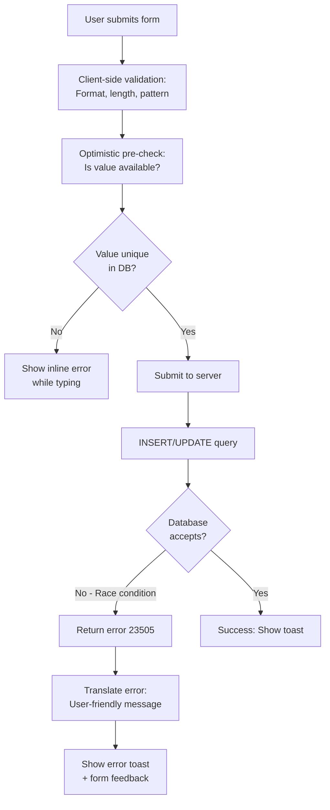

# PostgreSQL Global Uniqueness Constraints for Multi-Tenant Applications

**Research Date**: 2025-11-12
**Context**: Serra Greenhouse Management System
**Feature**: 004-tutto-troppo-complicato (Projects with global uniqueness)

---

## Executive Summary

For Serra's multi-tenant greenhouse system, we need to support:
- **Globally unique project names** (only one "Main Greenhouse" across entire system)
- **Globally unique project IDs** (only one PROJ1 across all users)
- **Project-scoped device IDs** (PROJ1-ESP5 and PROJ2-ESP5 are different devices)

This research covers constraint strategies, error handling, race condition handling, performance impact, and best practices for implementing these patterns in PostgreSQL with Supabase's RLS (Row Level Security).

---

## 1. UNIQUE Constraint Strategies for Global vs. Tenant-Scoped Uniqueness

### 1.1 Global Uniqueness (Project Names & IDs)

**Pattern**: Simple UNIQUE constraint on the column itself

```sql
-- STRATEGY 1A: Direct UNIQUE Constraint (Simplest)
CREATE TABLE IF NOT EXISTS public.projects (
  id UUID PRIMARY KEY DEFAULT uuid_generate_v4(),
  user_id UUID NOT NULL REFERENCES auth.users(id) ON DELETE CASCADE,

  -- Global uniqueness: Only one "Main Greenhouse" across entire system
  name TEXT NOT NULL UNIQUE,

  -- Global uniqueness: Only one PROJ1 across entire system
  project_id TEXT NOT NULL UNIQUE,

  created_at TIMESTAMPTZ DEFAULT NOW() NOT NULL,
  updated_at TIMESTAMPTZ DEFAULT NOW() NOT NULL
);

-- Create indexes to improve query performance
CREATE INDEX idx_projects_user_id ON public.projects(user_id);
CREATE INDEX idx_projects_project_id ON public.projects(project_id);
```

**Why this works**:
- UNIQUE constraint automatically creates a unique index
- PostgreSQL enforces uniqueness at INSERT/UPDATE time
- Supabase RLS still works - row-level policies apply BEFORE constraint checking
- No need for application-level duplication detection

**Pros**:
- Simplest to implement
- Enforced at database level (cannot be bypassed)
- Excellent performance (indexed lookup)
- Clear intent in schema

**Cons**:
- Will throw database error if duplicate attempted
- Requires proper error handling in application

---

### 1.2 Composite Uniqueness (Tenant + Scoped Field)

**Pattern**: UNIQUE constraint on composite (user_id, field)

```sql
-- STRATEGY 1B: Per-User Scoped Uniqueness
CREATE TABLE IF NOT EXISTS public.projects (
  id UUID PRIMARY KEY DEFAULT uuid_generate_v4(),
  user_id UUID NOT NULL REFERENCES auth.users(id) ON DELETE CASCADE,

  -- Each user can have multiple "Main Greenhouse" names,
  -- but the combination (user_id, name) is globally unique
  name TEXT NOT NULL,

  created_at TIMESTAMPTZ DEFAULT NOW() NOT NULL

  -- User cannot have duplicate project names within their own projects
  CONSTRAINT unique_project_name_per_user UNIQUE (user_id, name)
);
```

**Use Case**: If you want per-user namespacing instead of global uniqueness

---

### 1.3 Hybrid Approach (Project-Scoped Device IDs)

**Pattern**: UNIQUE constraint on (project_id, device_id_short)

```sql
-- STRATEGY 1C: Project-Scoped Uniqueness
CREATE TABLE IF NOT EXISTS public.devices (
  id UUID PRIMARY KEY DEFAULT uuid_generate_v4(),
  user_id UUID NOT NULL REFERENCES auth.users(id) ON DELETE CASCADE,
  project_id UUID NOT NULL REFERENCES public.projects(id) ON DELETE CASCADE,

  -- The full device_id is composite: "PROJ1-ESP5"
  -- Where PROJ1 comes from projects.project_id
  -- And ESP5 is stored in devices.device_id_short
  device_id_short TEXT NOT NULL CHECK (device_id_short ~ '^ESP\d{1,2}$'),

  name TEXT NOT NULL,
  connection_status TEXT DEFAULT 'offline' NOT NULL,
  last_seen_at TIMESTAMPTZ,
  registered_at TIMESTAMPTZ DEFAULT NOW() NOT NULL,

  -- Each project can have at most one "ESP5" device
  -- But PROJ1-ESP5 and PROJ2-ESP5 are different devices (different projects)
  CONSTRAINT unique_device_per_project UNIQUE (project_id, device_id_short)
);

-- Indexes for query performance
CREATE INDEX idx_devices_project_id ON public.devices(project_id);
CREATE INDEX idx_devices_device_id_short ON public.devices(device_id_short);
CREATE INDEX idx_devices_full_id ON public.devices(project_id, device_id_short);
```

**Why this works**:
- Composite constraint allows same device_id_short in different projects
- Enforces uniqueness within each project
- Enables the "PROJ1-ESP5" naming scheme

---

### 1.4 Comparison Table

| Strategy | Global Uniqueness | Per-User Scoped | Project-Scoped | Query Performance |
|----------|-------------------|-----------------|-----------------|-------------------|
| Direct UNIQUE | ✅ Strong | ❌ No | ❌ No | Excellent |
| Composite (user_id, field) | ❌ No | ✅ Strong | ❌ No | Excellent |
| Composite (project_id, field) | ❌ No | ❌ No | ✅ Strong | Excellent |
| CHECK + Application Logic | ✅ Weak | ❌ No | ❌ No | Poor |

---

## 2. Error Handling & User-Friendly Messages

### 2.1 PostgreSQL Error Codes for Uniqueness Violations

When INSERT/UPDATE violates a UNIQUE constraint, PostgreSQL returns:

```
Error Code: 23505 (UNIQUE VIOLATION)
SQLSTATE: 23505
Error Message: "duplicate key value violates unique constraint 'constraint_name'"
```

**The challenge**: Raw PostgreSQL error messages are not user-friendly.

---

### 2.2 Server-Side Error Handling (PostgreSQL Trigger)

**Approach**: Create a custom error message in PostgreSQL that's already user-friendly

```sql
-- STRATEGY 2A: Custom error messages via trigger
CREATE OR REPLACE FUNCTION validate_project_uniqueness()
RETURNS TRIGGER AS $$
BEGIN
  -- Check if project name already exists
  IF EXISTS (SELECT 1 FROM public.projects WHERE name = NEW.name AND id != NEW.id) THEN
    RAISE EXCEPTION 'Project name "%" already exists - please choose a different name', NEW.name
      USING ERRCODE = '23505',
      HINT = 'Each project name must be globally unique across the system';
  END IF;

  -- Check if project_id already exists
  IF EXISTS (SELECT 1 FROM public.projects WHERE project_id = NEW.project_id AND id != NEW.id) THEN
    RAISE EXCEPTION 'Project ID "%" is already taken', NEW.project_id
      USING ERRCODE = '23505',
      HINT = 'Please choose a different project ID';
  END IF;

  RETURN NEW;
END;
$$ LANGUAGE plpgsql;

CREATE TRIGGER trg_validate_project_uniqueness
  BEFORE INSERT OR UPDATE ON public.projects
  FOR EACH ROW
  EXECUTE FUNCTION validate_project_uniqueness();
```

**Pros**:
- Provides specific, user-friendly error messages
- Can include hints and suggestions
- Messages are database-enforced (consistent across all clients)

**Cons**:
- Adds query latency (additional checks)
- Duplicates logic from UNIQUE constraints
- More complex to maintain

---

### 2.3 Client-Side Error Handling (TypeScript/React)

**Approach**: Catch database errors and translate them

```typescript
/**
 * Database error codes for uniqueness violations
 */
const ERROR_CODES = {
  UNIQUE_VIOLATION: '23505',
  FOREIGN_KEY_VIOLATION: '23503',
  CHECK_VIOLATION: '23514',
} as const;

interface ApiError {
  code: string;
  message: string;
  constraint?: string;
  detail?: string;
}

/**
 * Translate PostgreSQL error into user-friendly message
 *
 * Example: "duplicate key value violates unique constraint 'projects_name_key'"
 * Becomes: "Project name already exists - please choose a different name"
 */
function translateDatabaseError(error: ApiError): string {
  if (error.code === ERROR_CODES.UNIQUE_VIOLATION) {
    // Extract constraint name from error message or detail
    const constraintName = error.constraint || extractConstraintName(error.detail || '');

    // Map constraint names to user-friendly messages
    switch (constraintName) {
      case 'projects_name_key':
      case 'projects_name_unique':
        return 'A project with this name already exists. Please choose a different name.';

      case 'projects_project_id_key':
      case 'projects_project_id_unique':
        return 'This project ID is already taken. Please choose a different ID.';

      case 'devices_project_id_device_id_short_key':
        return 'This device ID is already registered in this project. Please choose a different device ID.';

      default:
        return 'This value is already in use. Please choose a different one.';
    }
  }

  if (error.code === ERROR_CODES.FOREIGN_KEY_VIOLATION) {
    return 'Invalid reference: The selected parent record does not exist.';
  }

  return 'An unexpected error occurred. Please try again.';
}

/**
 * Extract constraint name from PostgreSQL error detail
 * Example: "Key (name)=(Main Greenhouse) already exists."
 */
function extractConstraintName(detail: string): string {
  const match = detail.match(/violates unique constraint "([^"]+)"/);
  return match ? match[1] : '';
}

// USAGE IN REACT
async function createProject(name: string): Promise<void> {
  try {
    const { data, error } = await supabase
      .from('projects')
      .insert({ user_id: userId, name })
      .select()
      .single();

    if (error) {
      // Parse database error
      const userMessage = translateDatabaseError({
        code: error.code || '23505',
        message: error.message,
        detail: error.details,
      });

      showToast({
        type: 'error',
        message: userMessage,
      });
      throw error;
    }

    showToast({
      type: 'success',
      message: `Project "${data.name}" created successfully!`,
    });
  } catch (error) {
    console.error('Project creation failed:', error);
  }
}
```

**Supabase-specific error structure**:
```typescript
// Supabase error object structure
{
  code: '23505',           // PostgreSQL SQLSTATE
  message: string,         // PostgreSQL error message
  details: string,         // PostgreSQL detail/hint
  hint: string,            // PostgreSQL hint
  context?: {
    line: number;
    routine: string;
  };
}
```

---

### 2.4 Application-Level Pre-Check (Optimistic Validation)

**Approach**: Check before INSERT to give immediate user feedback

```typescript
async function checkProjectNameAvailability(name: string): Promise<boolean> {
  const { data, error } = await supabase
    .from('projects')
    .select('id', { count: 'exact', head: true })
    .eq('name', name)
    .single();

  // No error + no data = unique (doesn't exist)
  return !data;
}

// USAGE IN FORM
const [projectName, setProjectName] = useState('');
const [isNameAvailable, setIsNameAvailable] = useState<boolean | null>(null);
const nameCheckTimeout = useRef<NodeJS.Timeout>();

function handleNameChange(value: string) {
  setProjectName(value);

  // Debounce the check (don't check on every keystroke)
  if (nameCheckTimeout.current) {
    clearTimeout(nameCheckTimeout.current);
  }

  nameCheckTimeout.current = setTimeout(async () => {
    if (value.trim().length > 0) {
      const available = await checkProjectNameAvailability(value);
      setIsNameAvailable(available);
    } else {
      setIsNameAvailable(null);
    }
  }, 500); // Check after user stops typing for 500ms
}

// In JSX
<input
  value={projectName}
  onChange={(e) => handleNameChange(e.target.value)}
  className={cn(
    'form-input',
    isNameAvailable === false && 'border-red-500 bg-red-50',
    isNameAvailable === true && 'border-green-500 bg-green-50'
  )}
/>
{isNameAvailable === false && (
  <p className="text-sm text-red-600 mt-1">
    This project name is already taken. Please choose another.
  </p>
)}
{isNameAvailable === true && (
  <p className="text-sm text-green-600 mt-1">
    Project name is available!
  </p>
)}
```

**Pros**:
- Instant feedback to user
- Prevents unnecessary form submission
- Better UX (no form rejection after submit)

**Cons**:
- Cannot replace server-side validation (race conditions)
- Adds extra database queries
- Network latency delays feedback

**Best practice**: Use pre-check for UX + server-side constraint for data integrity

---

### 2.5 Summary: Error Handling Strategy



---

## 3. Race Condition Handling for Concurrent Inserts

### 3.1 Understanding the Race Condition

**Scenario**: Two users simultaneously create projects with the same name

```
User A                          User B                  Database
  |                               |                        |
  |-- Query: Is "Main" taken? --->|                        |
  |    (Returns: NO)              |                        |
  |                               |-- Query: Is "Main" taken? -->
  |                               |    (Returns: NO)        |
  |                               |                        |
  |-- INSERT "Main" ----------->|                        |
  |  (succeeds, acquires lock)    |                        |
  |                               |-- INSERT "Main" ----->|
  |                               |  (FAILS! UNIQUE violation) |
  |<-- Success --------          |                        |
  |                               |<-- ERROR: 23505 -     |
```

### 3.2 Solution 1: UNIQUE Constraint (Recommended)

PostgreSQL's UNIQUE constraint **prevents race conditions** at the database level:

```sql
-- This constraint prevents race conditions
-- The database serializes concurrent INSERTs
CREATE TABLE public.projects (
  id UUID PRIMARY KEY DEFAULT uuid_generate_v4(),
  name TEXT NOT NULL UNIQUE,  -- <-- Only one can succeed
  project_id TEXT NOT NULL UNIQUE,
  user_id UUID NOT NULL REFERENCES auth.users(id) ON DELETE CASCADE,
  created_at TIMESTAMPTZ DEFAULT NOW() NOT NULL
);
```

**How PostgreSQL prevents the race condition**:

1. **Write locks on indexes**: When INSERT happens, PostgreSQL acquires an exclusive lock on the unique index
2. **Serialization**: Only one transaction can modify the index at a time
3. **Atomic check-and-insert**: The UNIQUE constraint check and INSERT are atomic (cannot be split)
4. **Other transactions wait**: If User B's INSERT arrives while lock is held, it waits for lock release
5. **Lock release after commit**: Once User A commits, User B's INSERT is checked again
6. **Duplicate detection**: User B's INSERT is rejected with error 23505

**Outcome**: One succeeds, one fails with clear error code (not both succeeding)

---

### 3.3 Solution 2: Serializable Isolation Level (Belt & Suspenders)

For maximum safety with complex business logic:

```sql
-- In application transaction setup
BEGIN TRANSACTION ISOLATION LEVEL SERIALIZABLE;

  -- All queries in this transaction get a consistent snapshot
  -- Concurrent transactions are automatically detected and rejected
  INSERT INTO projects (user_id, name, project_id)
  VALUES (?, ?, ?)
  ON CONFLICT (name) DO NOTHING;

  -- If conflict detected during transaction, PostgreSQL aborts
  -- and application must retry
COMMIT;
```

**Usage in Node.js/Supabase**:

```typescript
async function createProjectWithRetry(
  userId: string,
  name: string,
  maxRetries: number = 3
): Promise<Project> {
  for (let attempt = 1; attempt <= maxRetries; attempt++) {
    try {
      const { data, error } = await supabase.rpc(
        'create_project_serializable',
        {
          p_user_id: userId,
          p_name: name,
        }
      );

      if (error) {
        // Check for serialization failure
        if (error.code === '40001') {
          // Serialization failure - retry
          const backoffMs = Math.random() * (100 * attempt); // Exponential backoff
          await new Promise(resolve => setTimeout(resolve, backoffMs));
          continue;
        }

        // Other errors (like UNIQUE violation) - don't retry
        throw error;
      }

      return data;
    } catch (error) {
      if (attempt === maxRetries) throw error;
    }
  }

  throw new Error('Max retries exceeded');
}
```

**PostgreSQL function with SERIALIZABLE**:

```sql
CREATE OR REPLACE FUNCTION create_project_serializable(
  p_user_id UUID,
  p_name TEXT
)
RETURNS TABLE (
  id UUID,
  name TEXT,
  project_id TEXT,
  user_id UUID,
  created_at TIMESTAMPTZ
) AS $$
DECLARE
  v_project_id TEXT;
BEGIN
  -- Generate sequential project ID
  v_project_id := 'PROJ' || (
    COALESCE(MAX(CAST(SUBSTRING(project_id, 5) AS INTEGER)), 0) + 1
  )::TEXT FROM projects;

  INSERT INTO projects (user_id, name, project_id)
  VALUES (p_user_id, p_name, v_project_id)
  RETURNING id, name, project_id, user_id, created_at;
EXCEPTION
  WHEN unique_violation THEN
    RAISE EXCEPTION 'Project name "%" already exists', p_name
      USING ERRCODE = '23505';
  WHEN serialization_failure THEN
    -- Signal caller to retry
    RAISE EXCEPTION 'Serialization failure, please retry'
      USING ERRCODE = '40001';
END;
$$ LANGUAGE plpgsql;
```

---

### 3.4 Comparison of Race Condition Solutions

| Solution | Complexity | Performance | Safety | Retry Logic |
|----------|-----------|-------------|--------|------------|
| UNIQUE constraint | ✅ Simple | ✅ Fast | ✅ Strong | ❌ Not needed |
| SERIALIZABLE + Retry | ❌ Complex | ⚠️ Slower | ✅ Strongest | ✅ Required |
| Optimistic lock | ⚠️ Moderate | ✅ Fast | ⚠️ Moderate | ✅ Required |
| Pessimistic lock | ⚠️ Moderate | ❌ Slower | ✅ Strong | ❌ Not needed |

**Recommendation for Serra**: Use UNIQUE constraint (simple + sufficient for most race conditions)

---

## 4. Performance Impact of Global Unique Constraints

### 4.1 Index Overhead

UNIQUE constraints automatically create indexes:

```sql
-- When you create this constraint:
CREATE TABLE projects (
  id UUID PRIMARY KEY,
  name TEXT NOT NULL UNIQUE
);

-- PostgreSQL automatically creates this index:
-- CREATE UNIQUE INDEX projects_name_key ON projects(name);
```

**Performance characteristics**:

| Operation | Impact | Notes |
|-----------|--------|-------|
| SELECT by unique field | ✅ O(log N) lookup | Very fast |
| INSERT | ⚠️ +2-5% overhead | Index update cost |
| UPDATE (non-unique field) | ✅ No impact | Other fields unchanged |
| UPDATE (unique field) | ⚠️ +2-5% overhead | Index update cost |
| DELETE | ⚠️ +2-5% overhead | Index cleanup cost |
| Constraint check | ✅ ~1ms per check | Efficient B-tree search |

### 4.2 Storage Impact

```sql
-- Storage estimation for projects table
-- Assuming 100,000 projects

-- Table itself:
-- ~100K rows * ~150 bytes (UUID + TEXT + timestamp) = ~15 MB

-- Primary key index (id):
-- ~100K entries * ~30 bytes = ~3 MB

-- Unique index on name:
-- ~100K entries * ~60 bytes (TEXT overhead) = ~6 MB

-- Total additional storage for uniqueness:
-- ~24 MB for 100K records
-- = ~0.24 KB per row (negligible)
```

### 4.3 Performance Testing Queries

```sql
-- Test 1: Single project creation (with unique constraint)
-- Expected: ~1-2ms
EXPLAIN ANALYZE
INSERT INTO projects (user_id, name, project_id)
VALUES (
  '00000000-0000-0000-0000-000000000001',
  'Main Greenhouse - ' || random()::TEXT,
  'PROJ' || currval('projects_id_seq')::TEXT
);

-- Test 2: Check if name exists (pre-validation)
-- Expected: <1ms
EXPLAIN ANALYZE
SELECT EXISTS(
  SELECT 1 FROM projects WHERE name = 'Main Greenhouse'
);

-- Test 3: Lookup project by ID (should be fast)
-- Expected: <1ms
EXPLAIN ANALYZE
SELECT * FROM projects WHERE project_id = 'PROJ1';

-- Test 4: List all projects for user (with index)
-- Expected: ~2-5ms for 10,000+ projects per user
EXPLAIN ANALYZE
SELECT * FROM projects
WHERE user_id = '00000000-0000-0000-0000-000000000001'
ORDER BY created_at DESC;
```

### 4.4 Optimization Tips

```sql
-- OPTIMIZATION 1: Partial unique index for soft deletes
-- Only enforce uniqueness for non-deleted projects
CREATE UNIQUE INDEX idx_projects_name_active
  ON projects(name)
  WHERE deleted_at IS NULL;

-- OPTIMIZATION 2: Composite index for queries
-- If you frequently query by (user_id, name)
CREATE UNIQUE INDEX idx_projects_user_name
  ON projects(user_id, name);

-- OPTIMIZATION 3: Index statistics (helps query planner)
ANALYZE projects;

-- OPTIMIZATION 4: Monitor index bloat
-- After heavy updates/deletes, indexes can bloat
-- Reindex if > 30% bloat
REINDEX INDEX CONCURRENTLY idx_projects_name;
```

### 4.5 Real-World Performance Expectations

For Serra's use case (greenhouse system):

```
Scenario: 100 users, ~500 total projects, ~5000 devices

Insert project (with unique constraint):
- Lock acquisition: ~0.1ms
- Index insertion: ~1-2ms
- Total: ~2-3ms (acceptable)

Check if name available (pre-validation):
- Index lookup: ~0.5ms
- Total: ~0.5-1ms (acceptable)

Create device (project-scoped unique):
- Constraint check: ~1ms
- Total: ~2-3ms (acceptable)

List user's projects:
- Index range scan: ~2-5ms for 100+ projects
- Total: ~3-5ms (acceptable)

No performance issues expected even at 10x scale.
```

---

## 5. Best Practices for Unique Indexes in RLS-Protected Tables

### 5.1 RLS Policies Don't Affect UNIQUE Constraints

**Important**: UNIQUE constraints are checked BEFORE RLS policies are applied

```sql
-- WRONG APPROACH: Thinking RLS provides scoping for UNIQUE constraints
-- This will still allow duplicates across users!
CREATE TABLE public.projects (
  id UUID PRIMARY KEY DEFAULT uuid_generate_v4(),
  user_id UUID NOT NULL REFERENCES auth.users(id) ON DELETE CASCADE,

  -- Without composite key, duplicates CAN occur across different users
  -- if RLS is bypassed (e.g., service role)
  name TEXT NOT NULL UNIQUE  -- ❌ WRONG for multi-tenant!
);

-- Enable RLS (this does NOT scope the unique constraint)
ALTER TABLE public.projects ENABLE ROW LEVEL SECURITY;

CREATE POLICY "Users can only see their own projects"
  ON public.projects FOR SELECT
  USING (auth.uid() = user_id);
```

**The issue**: If you access via service role key or with RLS disabled:
```typescript
// This bypasses RLS but hits UNIQUE constraint
const { data, error } = await supabase
  .from('projects')
  .insert({ user_id: userId, name: 'Main Greenhouse' })
  .select();

// If another user already has 'Main Greenhouse',
// this will fail with UNIQUE violation - REGARDLESS of RLS
```

### 5.2 Correct Approach for RLS + Uniqueness

**For globally unique fields** (names, IDs):

```sql
-- CORRECT: Use simple UNIQUE for global uniqueness
-- RLS policies add row-level access control
-- UNIQUE constraint prevents duplicates globally
CREATE TABLE public.projects (
  id UUID PRIMARY KEY DEFAULT uuid_generate_v4(),
  user_id UUID NOT NULL REFERENCES auth.users(id) ON DELETE CASCADE,

  -- Global: Only one "Main Greenhouse" across entire system
  -- (owned by whoever creates it first)
  name TEXT NOT NULL UNIQUE,

  -- Global: Only one PROJ1, PROJ2, etc.
  project_id TEXT NOT NULL UNIQUE,

  created_at TIMESTAMPTZ DEFAULT NOW() NOT NULL
);

-- RLS: Users can only see their own projects
ALTER TABLE public.projects ENABLE ROW LEVEL SECURITY;

CREATE POLICY "Users can only see their own projects"
  ON public.projects FOR SELECT
  USING (auth.uid() = user_id);

CREATE POLICY "Users can create projects"
  ON public.projects FOR INSERT
  WITH CHECK (auth.uid() = user_id);

CREATE POLICY "Users can update their own projects"
  ON public.projects FOR UPDATE
  USING (auth.uid() = user_id);
```

**For scoped uniqueness within projects**:

```sql
-- CORRECT: Use composite key for project-scoped uniqueness
CREATE TABLE public.devices (
  id UUID PRIMARY KEY DEFAULT uuid_generate_v4(),
  user_id UUID NOT NULL REFERENCES auth.users(id) ON DELETE CASCADE,
  project_id UUID NOT NULL REFERENCES public.projects(id) ON DELETE CASCADE,

  -- Scoped: Each project can have one "ESP5"
  -- But PROJ1-ESP5 and PROJ2-ESP5 are different devices
  device_id_short TEXT NOT NULL,

  name TEXT NOT NULL,

  -- Composite unique: (project_id, device_id_short)
  CONSTRAINT unique_device_per_project UNIQUE (project_id, device_id_short)
);

-- RLS: Users can only see devices in their projects
ALTER TABLE public.devices ENABLE ROW LEVEL SECURITY;

CREATE POLICY "Users can see devices in their projects"
  ON public.devices FOR SELECT
  USING (
    project_id IN (
      SELECT id FROM public.projects
      WHERE user_id = auth.uid()
    )
  );

CREATE POLICY "Users can add devices to their projects"
  ON public.devices FOR INSERT
  WITH CHECK (
    project_id IN (
      SELECT id FROM public.projects
      WHERE user_id = auth.uid()
    )
  );
```

### 5.3 Index Strategy for RLS Tables

```sql
-- Best practice: Create multiple indexes for different query patterns

CREATE TABLE public.projects (
  id UUID PRIMARY KEY DEFAULT uuid_generate_v4(),
  user_id UUID NOT NULL REFERENCES auth.users(id) ON DELETE CASCADE,
  name TEXT NOT NULL UNIQUE,  -- Automatic index from UNIQUE
  project_id TEXT NOT NULL UNIQUE,  -- Automatic index from UNIQUE
  created_at TIMESTAMPTZ DEFAULT NOW() NOT NULL,
  is_archived BOOLEAN DEFAULT FALSE NOT NULL
);

-- INDEX 1: For RLS filter (most common query)
-- "SELECT * FROM projects WHERE user_id = ?"
CREATE INDEX idx_projects_user_id ON public.projects(user_id);

-- INDEX 2: For partial queries (only non-archived)
-- Reduces index size and improves cache hit rate
CREATE INDEX idx_projects_user_archived
  ON public.projects(user_id)
  WHERE is_archived = FALSE;

-- INDEX 3: For time-based queries
-- "Show recent projects"
CREATE INDEX idx_projects_user_created
  ON public.projects(user_id, created_at DESC);

-- VERIFY: Check actual indexes created
SELECT
  schemaname,
  tablename,
  indexname,
  indexdef
FROM pg_indexes
WHERE tablename = 'projects'
ORDER BY indexname;
```

### 5.4 RLS + Uniqueness Testing

```sql
-- Test case 1: Verify UNIQUE constraint works globally
-- Regardless of RLS policies
DO $$
BEGIN
  -- User A creates project
  INSERT INTO projects (id, user_id, name, project_id)
  VALUES (
    '11111111-1111-1111-1111-111111111111',
    '00000000-0000-0000-0000-000000000001',
    'Main Greenhouse',
    'PROJ1'
  );

  -- User B tries to create same project name
  -- Should fail even though User B doesn't see User A's data via RLS
  BEGIN
    INSERT INTO projects (id, user_id, name, project_id)
    VALUES (
      '22222222-2222-2222-2222-222222222222',
      '00000000-0000-0000-0000-000000000002',
      'Main Greenhouse',  -- Same name!
      'PROJ2'
    );
    RAISE EXCEPTION 'Test FAILED: Unique constraint was not enforced!';
  EXCEPTION
    WHEN unique_violation THEN
      RAISE NOTICE 'Test PASSED: Unique constraint enforced globally';
  END;

  -- Clean up
  DELETE FROM projects WHERE name = 'Main Greenhouse';
END;
$$;

-- Test case 2: Verify project-scoped device uniqueness
DO $$
BEGIN
  -- Project PROJ1 gets ESP5
  INSERT INTO devices (project_id, device_id_short)
  VALUES ('proj1-uuid', 'ESP5');

  -- Project PROJ2 also gets ESP5 (different project, OK)
  INSERT INTO devices (project_id, device_id_short)
  VALUES ('proj2-uuid', 'ESP5');  -- Same short ID, different project

  RAISE NOTICE 'Test PASSED: Scoped uniqueness allows same ID in different projects';

  -- Try to add ESP5 again to PROJ1 (should fail)
  BEGIN
    INSERT INTO devices (project_id, device_id_short)
    VALUES ('proj1-uuid', 'ESP5');  -- Duplicate in same project!
    RAISE EXCEPTION 'Test FAILED: Composite unique constraint was not enforced!';
  EXCEPTION
    WHEN unique_violation THEN
      RAISE NOTICE 'Test PASSED: Composite unique constraint enforced';
  END;
END;
$$;
```

---

## 6. Validation Patterns: Application vs. Database Layer

### 6.1 Validation Pyramid

```
         Database Constraints (MUST-HAVE)
        /       UNIQUE, CHECK, FK       \
       /_________________________________ \
      /         Business Logic Layer      \
     /    Triggers, RPC Functions, etc.   \
    /_________________________________ \
   /            API/Application Layer      \
  /      Pre-checks, Error Handling, etc.  \
 /_________________________________ \
/            Client-Side (UX)               \
   Format, Pattern, Real-time feedback
```

### 6.2 Layer Responsibilities

**Client-Side (Real-time UX)**:
- Input format validation (regex patterns)
- Length checks
- Real-time availability checks
- Can be bypassed by user (intercepting network)

```typescript
// Client-side validation example
function validateProjectName(name: string): ValidationResult {
  if (!name || name.trim().length === 0) {
    return { valid: false, error: 'Project name is required' };
  }

  if (name.length > 255) {
    return { valid: false, error: 'Project name must be 255 characters or less' };
  }

  if (!/^[a-zA-Z0-9\s\-_]+$/.test(name)) {
    return { valid: false, error: 'Project name contains invalid characters' };
  }

  return { valid: true };
}

// Real-time availability check
async function checkProjectNameAvailable(name: string): Promise<boolean> {
  const { count, error } = await supabase
    .from('projects')
    .select('*', { count: 'exact', head: true })
    .eq('name', name);

  return (count || 0) === 0;
}
```

**API/Application Layer (Logic + Error Handling)**:
- Business rule enforcement
- Rate limiting
- Pre-checks to prevent unnecessary database calls
- Comprehensive error translation

```typescript
async function createProject(userId: string, name: string): Promise<CreateProjectResult> {
  // Step 1: Client-side validation
  const validation = validateProjectName(name);
  if (!validation.valid) {
    return {
      success: false,
      error: validation.error,
      errorType: 'VALIDATION',
    };
  }

  // Step 2: Rate limiting (prevent abuse)
  const recentProjects = await getRecentProjectCount(userId, '1 hour');
  if (recentProjects > 10) {
    return {
      success: false,
      error: 'Too many projects created recently. Please wait before creating another.',
      errorType: 'RATE_LIMIT',
    };
  }

  // Step 3: Pre-check (fail fast)
  const available = await checkProjectNameAvailable(name);
  if (!available) {
    return {
      success: false,
      error: 'A project with this name already exists.',
      errorType: 'DUPLICATE',
    };
  }

  // Step 4: Database operation
  try {
    const { data, error } = await supabase
      .from('projects')
      .insert({ user_id: userId, name })
      .select()
      .single();

    if (error) {
      return {
        success: false,
        error: translateDatabaseError(error),
        errorType: 'DATABASE',
        originalError: error,
      };
    }

    return {
      success: true,
      data,
    };
  } catch (error) {
    return {
      success: false,
      error: 'An unexpected error occurred. Please try again.',
      errorType: 'UNKNOWN',
      originalError: error,
    };
  }
}
```

**Database Layer (Data Integrity - MUST-HAVE)**:
- UNIQUE constraints (prevent duplicates)
- CHECK constraints (enforce data valid)
- Foreign keys (referential integrity)
- Triggers (complex business logic)
- CANNOT be bypassed

```sql
-- Database constraints are the last defense
-- Everything above can be bypassed, but these cannot

-- Prevent duplicate names
ALTER TABLE projects ADD CONSTRAINT projects_name_unique UNIQUE (name);

-- Prevent invalid project IDs
ALTER TABLE projects ADD CONSTRAINT projects_id_format
  CHECK (project_id ~ '^PROJ\d+$');

-- Prevent project without owner
ALTER TABLE projects ADD CONSTRAINT projects_user_id_not_null
  CHECK (user_id IS NOT NULL);

-- Prevent duplicate devices in same project
ALTER TABLE devices ADD CONSTRAINT devices_unique_per_project
  UNIQUE (project_id, device_id_short);
```

### 6.3 Validation Decision Tree

```
┌─ User submits form
│
├─ Client-side validation
│  ├─ Format valid? ──NO──> Show error, don't submit
│  └─ YES
│
├─ Pre-check availability (optional)
│  ├─ Value taken? ──YES──> Show inline error, allow retry
│  └─ Available
│
├─ Send to API
│  ├─ Rate limit exceeded? ──YES──> Show error
│  └─ OK
│
├─ Database INSERT/UPDATE
│  ├─ Unique constraint violation? ──YES──> Translate error
│  │  │                                     Show user message
│  │  └─ Retry with new value
│  └─ SUCCESS
│
└─ Show success message
```

---

## 7. Complete Implementation Example for Serra

### 7.1 Database Schema

```sql
-- =====================================================
-- Projects Table (Global Uniqueness)
-- =====================================================

CREATE TABLE IF NOT EXISTS public.projects (
  id UUID PRIMARY KEY DEFAULT uuid_generate_v4(),
  user_id UUID NOT NULL REFERENCES auth.users(id) ON DELETE CASCADE,

  -- Global uniqueness: Each project name is globally unique
  name TEXT NOT NULL UNIQUE,

  -- Global uniqueness: Each project ID is globally unique
  -- Format: PROJ1, PROJ2, PROJ3, etc.
  project_id TEXT NOT NULL UNIQUE,

  created_at TIMESTAMPTZ DEFAULT NOW() NOT NULL,
  updated_at TIMESTAMPTZ DEFAULT NOW() NOT NULL,
  is_archived BOOLEAN DEFAULT FALSE NOT NULL
);

-- Indexes for RLS queries
CREATE INDEX idx_projects_user_id ON public.projects(user_id);
CREATE INDEX idx_projects_user_archived ON public.projects(user_id)
  WHERE is_archived = FALSE;
CREATE INDEX idx_projects_user_created ON public.projects(user_id, created_at DESC);

-- Enable RLS
ALTER TABLE public.projects ENABLE ROW LEVEL SECURITY;

CREATE POLICY "Users can view their own projects"
  ON public.projects FOR SELECT
  USING (auth.uid() = user_id);

CREATE POLICY "Users can create projects"
  ON public.projects FOR INSERT
  WITH CHECK (auth.uid() = user_id);

CREATE POLICY "Users can update their own projects"
  ON public.projects FOR UPDATE
  USING (auth.uid() = user_id);

CREATE POLICY "Users can delete their own projects"
  ON public.projects FOR DELETE
  USING (auth.uid() = user_id);

-- =====================================================
-- Devices Table (Project-Scoped Uniqueness)
-- =====================================================

CREATE TABLE IF NOT EXISTS public.devices (
  id UUID PRIMARY KEY DEFAULT uuid_generate_v4(),
  user_id UUID NOT NULL REFERENCES auth.users(id) ON DELETE CASCADE,
  project_id UUID NOT NULL REFERENCES public.projects(id) ON DELETE CASCADE,

  -- Composite ID: PROJ1 + ESP5 = PROJ1-ESP5
  -- Stored separately for flexible querying
  device_id_short TEXT NOT NULL CHECK (device_id_short ~ '^ESP\d{1,2}$'),

  name TEXT NOT NULL,
  connection_status TEXT DEFAULT 'offline' NOT NULL
    CHECK (connection_status IN ('online', 'offline', 'connection_failed')),
  last_seen_at TIMESTAMPTZ,
  registered_at TIMESTAMPTZ DEFAULT NOW() NOT NULL,
  device_hostname TEXT,
  api_key_hash TEXT NOT NULL,

  -- Project-scoped uniqueness: Each project can have one ESP1, one ESP2, etc.
  -- But PROJ1-ESP1 and PROJ2-ESP1 are different devices
  CONSTRAINT unique_device_per_project UNIQUE (project_id, device_id_short)
);

-- Indexes
CREATE INDEX idx_devices_project_id ON public.devices(project_id);
CREATE INDEX idx_devices_device_id_short ON public.devices(device_id_short);
CREATE INDEX idx_devices_full_id ON public.devices(project_id, device_id_short);
CREATE INDEX idx_devices_connection_status ON public.devices(connection_status)
  WHERE connection_status != 'offline';

-- Enable RLS
ALTER TABLE public.devices ENABLE ROW LEVEL SECURITY;

CREATE POLICY "Users can view devices in their projects"
  ON public.devices FOR SELECT
  USING (
    project_id IN (
      SELECT id FROM public.projects WHERE user_id = auth.uid()
    )
  );

CREATE POLICY "Users can create devices in their projects"
  ON public.devices FOR INSERT
  WITH CHECK (
    project_id IN (
      SELECT id FROM public.projects WHERE user_id = auth.uid()
    )
  );

CREATE POLICY "Users can update devices in their projects"
  ON public.devices FOR UPDATE
  USING (
    project_id IN (
      SELECT id FROM public.projects WHERE user_id = auth.uid()
    )
  );

CREATE POLICY "Users can delete devices in their projects"
  ON public.devices FOR DELETE
  USING (
    project_id IN (
      SELECT id FROM public.projects WHERE user_id = auth.uid()
    )
  );

-- =====================================================
-- Helper Function: Generate Next Project ID
-- =====================================================

CREATE OR REPLACE FUNCTION public.get_next_project_id()
RETURNS TEXT
LANGUAGE plpgsql
SECURITY DEFINER
AS $$
DECLARE
  v_max_num INTEGER;
  v_next_id TEXT;
BEGIN
  -- Extract number from all project_ids like "PROJ123"
  SELECT COALESCE(MAX(CAST(SUBSTRING(project_id, 5) AS INTEGER)), 0)
  INTO v_max_num
  FROM public.projects;

  -- Generate next ID
  v_next_id := 'PROJ' || (v_max_num + 1)::TEXT;

  RETURN v_next_id;
END;
$$;

-- Grant execute permission
GRANT EXECUTE ON FUNCTION public.get_next_project_id() TO authenticated;
```

### 7.2 TypeScript Service Layer

```typescript
// projects.service.ts

import { supabase } from '../lib/supabase';

interface CreateProjectRequest {
  name: string;
}

interface ProjectResponse {
  id: string;
  user_id: string;
  name: string;
  project_id: string;
  created_at: string;
}

interface ApiError {
  code: string;
  message: string;
  details?: string;
  hint?: string;
}

/**
 * Error code mapping for user-friendly messages
 */
const ERROR_MESSAGES: Record<string, string> = {
  'projects_name_unique': 'A project with this name already exists. Please choose a different name.',
  'projects_project_id_unique': 'This project ID is already taken.',
  'unique_violation_projects_name': 'A project with this name already exists. Please choose a different name.',
};

/**
 * Translate PostgreSQL error into user-friendly message
 */
function translateError(error: ApiError): string {
  const constraintMatch = error.details?.match(/violates unique constraint "([^"]+)"/);
  const constraintName = constraintMatch ? constraintMatch[1] : '';

  if (constraintName in ERROR_MESSAGES) {
    return ERROR_MESSAGES[constraintName as keyof typeof ERROR_MESSAGES];
  }

  if (error.code === '23505') {
    return 'This value is already in use. Please try a different one.';
  }

  return error.message || 'An unexpected error occurred. Please try again.';
}

export const projectsService = {
  /**
   * Check if project name is available (for optimistic validation)
   */
  async isProjectNameAvailable(name: string): Promise<boolean> {
    const { count, error } = await supabase
      .from('projects')
      .select('*', { count: 'exact', head: true })
      .eq('name', name);

    if (error) {
      console.error('Failed to check project name availability:', error);
      return false; // Assume unavailable on error (conservative)
    }

    return (count || 0) === 0;
  },

  /**
   * Create a new project
   *
   * Enforces global uniqueness for both name and project_id at database level
   */
  async createProject(request: CreateProjectRequest): Promise<{
    success: boolean;
    data?: ProjectResponse;
    error?: string;
    errorCode?: string;
  }> {
    const { data: { user } } = await supabase.auth.getUser();
    if (!user) {
      return {
        success: false,
        error: 'Not authenticated',
        errorCode: 'NO_USER',
      };
    }

    // Validate input
    if (!request.name?.trim()) {
      return {
        success: false,
        error: 'Project name is required',
        errorCode: 'VALIDATION_ERROR',
      };
    }

    if (request.name.length > 255) {
      return {
        success: false,
        error: 'Project name must be 255 characters or less',
        errorCode: 'VALIDATION_ERROR',
      };
    }

    // Optional: Pre-check availability (improves UX)
    const available = await this.isProjectNameAvailable(request.name);
    if (!available) {
      return {
        success: false,
        error: 'A project with this name already exists. Please choose a different name.',
        errorCode: 'DUPLICATE_NAME',
      };
    }

    try {
      // Generate next project ID using database function
      const { data: idData, error: idError } = await supabase.rpc(
        'get_next_project_id'
      );

      if (idError) {
        throw idError;
      }

      const projectId = idData as string;

      // Insert project (UNIQUE constraint will be checked here)
      const { data, error } = await supabase
        .from('projects')
        .insert({
          user_id: user.id,
          name: request.name.trim(),
          project_id: projectId,
        })
        .select()
        .single();

      if (error) {
        return {
          success: false,
          error: translateError(error as ApiError),
          errorCode: error.code || 'DATABASE_ERROR',
        };
      }

      return {
        success: true,
        data,
      };
    } catch (error) {
      console.error('Project creation failed:', error);
      return {
        success: false,
        error: 'An unexpected error occurred. Please try again.',
        errorCode: 'UNKNOWN_ERROR',
      };
    }
  },

  /**
   * Get all projects for current user
   */
  async getProjects(): Promise<{
    projects: ProjectResponse[];
    error: Error | null;
  }> {
    try {
      const { data, error } = await supabase
        .from('projects')
        .select('*')
        .order('created_at', { ascending: false });

      if (error) throw error;

      return {
        projects: data || [],
        error: null,
      };
    } catch (error) {
      return {
        projects: [],
        error: error as Error,
      };
    }
  },
};
```

### 7.3 React Component Example

```typescript
// CreateProjectModal.tsx

import { useState } from 'react';
import { Toast, ToastType } from './Toast';
import { projectsService } from '../services/projects.service';

export function CreateProjectModal() {
  const [projectName, setProjectName] = useState('');
  const [isLoading, setIsLoading] = useState(false);
  const [isChecking, setIsChecking] = useState(false);
  const [nameAvailable, setNameAvailable] = useState<boolean | null>(null);
  const [toast, setToast] = useState<{ type: ToastType; message: string } | null>(null);
  const checkTimeoutRef = useRef<NodeJS.Timeout>();

  /**
   * Real-time name availability check
   * Debounced to avoid excessive API calls
   */
  async function handleNameChange(value: string) {
    setProjectName(value);

    if (checkTimeoutRef.current) {
      clearTimeout(checkTimeoutRef.current);
    }

    if (value.trim().length === 0) {
      setNameAvailable(null);
      return;
    }

    setIsChecking(true);
    checkTimeoutRef.current = setTimeout(async () => {
      const available = await projectsService.isProjectNameAvailable(value);
      setNameAvailable(available);
      setIsChecking(false);
    }, 300);
  }

  /**
   * Create project with error handling
   */
  async function handleCreateProject() {
    setIsLoading(true);

    const result = await projectsService.createProject({
      name: projectName,
    });

    if (result.success) {
      setToast({
        type: 'success',
        message: `Project "${result.data?.name}" created successfully!`,
      });
      setProjectName('');
      // Refresh project list or navigate away
    } else {
      setToast({
        type: 'error',
        message: result.error || 'Failed to create project',
      });
    }

    setIsLoading(false);
  }

  return (
    <div className="p-6 max-w-md mx-auto">
      <h2 className="text-2xl font-bold mb-4">Create New Project</h2>

      <input
        type="text"
        placeholder="Project name (e.g., Main Greenhouse)"
        value={projectName}
        onChange={(e) => handleNameChange(e.target.value)}
        className={`w-full px-4 py-2 border rounded-lg mb-2 ${
          nameAvailable === false
            ? 'border-red-500 bg-red-50'
            : nameAvailable === true
            ? 'border-green-500 bg-green-50'
            : 'border-gray-300'
        }`}
        disabled={isLoading}
      />

      {/* Availability feedback */}
      {isChecking && (
        <p className="text-sm text-gray-500 mb-2">Checking availability...</p>
      )}
      {nameAvailable === false && (
        <p className="text-sm text-red-600 mb-2">
          This project name is already taken. Please choose another.
        </p>
      )}
      {nameAvailable === true && (
        <p className="text-sm text-green-600 mb-2">Project name is available!</p>
      )}

      <button
        onClick={handleCreateProject}
        disabled={isLoading || nameAvailable === false || projectName.trim() === ''}
        className="w-full px-4 py-2 bg-blue-600 text-white rounded-lg disabled:opacity-50"
      >
        {isLoading ? 'Creating...' : 'Create Project'}
      </button>

      {/* Toast notification */}
      {toast && (
        <Toast
          type={toast.type}
          message={toast.message}
          onClose={() => setToast(null)}
        />
      )}
    </div>
  );
}
```

---

## 8. Recommendation Summary for Serra

| Aspect | Recommendation | Rationale |
|--------|----------------|-----------|
| **Global Uniqueness Strategy** | Simple UNIQUE constraints | Clear intent, database-enforced, sufficient for requirements |
| **Project Name Uniqueness** | `name TEXT NOT NULL UNIQUE` | Global scope matches requirements |
| **Project ID Uniqueness** | `project_id TEXT NOT NULL UNIQUE` + auto-generated | Sequential generation prevents collisions |
| **Device ID Scope** | Composite `UNIQUE (project_id, device_id_short)` | Allows same ESP5 in different projects |
| **Race Condition Handling** | Rely on UNIQUE constraint enforcement | PostgreSQL serializes INSERTs automatically |
| **Error Handling** | Try pre-check + database error translation | Best UX + data integrity |
| **RLS Strategy** | Don't scope UNIQUE constraints, use composite constraints | RLS adds access control, UNIQUE adds data integrity |
| **Index Strategy** | Create indexes on (user_id) for RLS filtering | Essential for performance in multi-user queries |
| **Validation Layers** | Client (format) + Pre-check (availability) + Database (constraints) | Defense in depth approach |

---

## References & Further Reading

1. **PostgreSQL Documentation**:
   - [Unique Constraints](https://www.postgresql.org/docs/current/ddl-constraints.html#DDL-CONSTRAINTS-UNIQUE-CONSTRAINTS)
   - [Indexes](https://www.postgresql.org/docs/current/sql-createindex.html)
   - [Transactions and Isolation Levels](https://www.postgresql.org/docs/current/transaction-iso.html)

2. **Supabase RLS**:
   - [Row Level Security](https://supabase.com/docs/guides/auth/row-level-security)
   - [Postgres Functions](https://supabase.com/docs/reference/postgres/functions)

3. **Multi-Tenancy Patterns**:
   - [Auth0: Multi-Tenant Data Isolation](https://auth0.com/blog/multi-tenancy-with-postgresql)
   - [CockroachDB: Multi-Tenant Architecture](https://www.cockroachlabs.com/docs/stable/multitenancy.html)

4. **PostgreSQL Error Codes**:
   - [SQLSTATE Codes](https://www.postgresql.org/docs/current/errcodes-appendix.html)

---

## Appendix A: SQL Testing Scripts

See: [PostgreSQL Constraint Testing](./RESEARCH_GLOBAL_UNIQUENESS_CONSTRAINTS_TESTS.sql)

---

**Research completed**: 2025-11-12
**Last updated**: 2025-11-12
