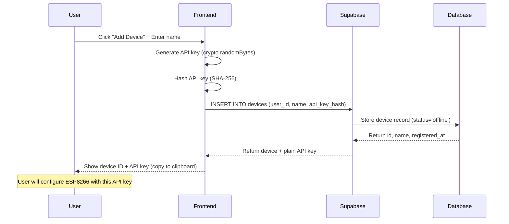

# API Contract: Device Registration

**Endpoint**: Register New Device
**Feature**: QR Code Device Onboarding
**Date**: 2025-10-09

---

## Frontend Service Method

### `devicesService.registerDevice()`

Creates a new device record and returns UUID + API key for ESP8266 configuration.

#### TypeScript Signature

```typescript
interface RegisterDeviceRequest {
  name: string;  // User-provided device label
}

interface RegisterDeviceResponse {
  device: {
    id: string;           // UUID
    name: string;         // Echo of input
    apiKey: string;       // Plain API key (shown once only)
    registeredAt: string; // ISO 8601 timestamp
  };
  qrCode: null;           // Generated later when hostname is known
}

async function registerDevice(
  request: RegisterDeviceRequest
): Promise<RegisterDeviceResponse>;
```

#### Request Example

```typescript
const response = await devicesService.registerDevice({
  name: "Greenhouse Main"
});
```

#### Implementation

```typescript
// frontend/src/services/devices.service.ts

import { supabase } from '../lib/supabase';
import crypto from 'crypto';

class DevicesService {
  async registerDevice(request: RegisterDeviceRequest): Promise<RegisterDeviceResponse> {
    // Get current user
    const { data: { user } } = await supabase.auth.getUser();
    if (!user) throw new Error('Not authenticated');

    // Generate API key (32-byte random, hex-encoded)
    const apiKey = crypto.randomBytes(32).toString('hex');
    const apiKeyHash = crypto.createHash('sha256').update(apiKey).digest('hex');

    // Insert device record
    const { data, error } = await supabase
      .from('devices')
      .insert({
        user_id: user.id,
        name: request.name,
        api_key_hash: apiKeyHash,
        connection_status: 'offline',
        last_seen_at: null,
      })
      .select('id, name, registered_at')
      .single();

    if (error) throw error;

    // Return device info + plain API key
    return {
      device: {
        id: data.id,
        name: data.name,
        apiKey: apiKey,  // IMPORTANT: Only shown once, not stored
        registeredAt: data.registered_at,
      },
      qrCode: null,  // Null until device sends first heartbeat with hostname
    };
  }
}
```

---

## Response Schema

### Success Response (200 OK)

```json
{
  "device": {
    "id": "550e8400-e29b-41d4-a716-446655440000",
    "name": "Greenhouse Main",
    "apiKey": "a1b2c3d4e5f6...64-char-hex-string",
    "registeredAt": "2025-10-09T15:30:00.000Z"
  },
  "qrCode": null
}
```

### Error Responses

#### 401 Unauthorized

User not authenticated.

```json
{
  "error": {
    "code": "UNAUTHORIZED",
    "message": "Not authenticated"
  }
}
```

#### 400 Bad Request

Invalid device name (empty or too long).

```json
{
  "error": {
    "code": "VALIDATION_ERROR",
    "message": "Device name must be between 1 and 255 characters",
    "field": "name"
  }
}
```

#### 500 Internal Server Error

Database insertion failed.

```json
{
  "error": {
    "code": "DATABASE_ERROR",
    "message": "Failed to create device record"
  }
}
```

---

## Validation Rules

### Request Validation

```typescript
function validateRegisterDeviceRequest(request: RegisterDeviceRequest): void {
  if (!request.name || request.name.trim().length === 0) {
    throw new ValidationError('Device name is required');
  }

  if (request.name.length > 255) {
    throw new ValidationError('Device name must be 255 characters or less');
  }

  // Sanitize name (remove control characters)
  request.name = request.name.replace(/[\x00-\x1F\x7F]/g, '');
}
```

### Database Constraints

```sql
-- Enforced by database schema
CHECK (LENGTH(name) >= 1 AND LENGTH(name) <= 255)
CHECK (user_id IS NOT NULL)
CHECK (api_key_hash IS NOT NULL)
```

---

## Security Considerations

1. **API Key Generation**:
   - Use cryptographically secure random generator (`crypto.randomBytes`)
   - Minimum 256 bits of entropy (32 bytes → 64 hex chars)
   - Never log or expose hashed API key

2. **API Key Storage**:
   - Store only SHA-256 hash in database
   - Plain API key returned ONCE in registration response
   - User must copy and save API key immediately (not retrievable later)

3. **Row Level Security**:
   ```sql
   -- Ensure user can only create devices for themselves
   CREATE POLICY "Users can insert their own devices"
   ON devices FOR INSERT
   WITH CHECK (auth.uid() = user_id);
   ```

---

## Usage Flow



---

## Rate Limiting

**Limit**: 10 device registrations per user per hour

**Implementation**:
```typescript
// Check device count in last hour
const { count } = await supabase
  .from('devices')
  .select('id', { count: 'exact', head: true })
  .eq('user_id', user.id)
  .gte('registered_at', new Date(Date.now() - 3600000).toISOString());

if (count >= 10) {
  throw new RateLimitError('Maximum 10 devices can be registered per hour');
}
```

---

## Example Frontend Integration

```typescript
// In AddDeviceModal.tsx

const [deviceName, setDeviceName] = useState('');
const [deviceInfo, setDeviceInfo] = useState<RegisterDeviceResponse | null>(null);

async function handleRegister() {
  try {
    const response = await devicesService.registerDevice({ name: deviceName });
    setDeviceInfo(response);

    // Show success with API key (user must copy it)
    alert(`Device created!\n\nID: ${response.device.id}\nAPI Key: ${response.device.apiKey}\n\nSave this API key - it won't be shown again!`);
  } catch (error) {
    console.error('Registration failed:', error);
    alert('Failed to register device');
  }
}
```

---

**Related Contracts**:
- [device-heartbeat.md](./device-heartbeat.md) - ESP8266 sends first heartbeat with hostname
- [qr-code-generation.md](./qr-code-generation.md) - Generate QR code from device hostname
